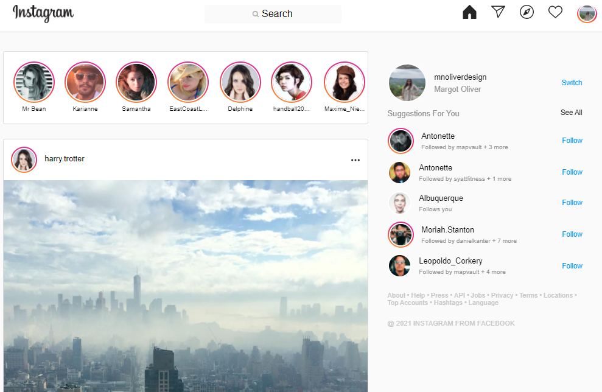

[Instagram Mock Website Live on the Web](https://dazzling-brown-299d66.netlify.app/)

This site displays a mock homepage for Instagram, it is fully reactive and will display properly on whatever size device you are viewing it on.
Features to be added: working comments and likes.
 
[Pravatar.cc](https://pravatar.cc/) was used to generate random pictures for the users.

### Available Scripts

In the project directory, you can run:

### `npm start`

Runs the app in the development mode.\
Open [http://localhost:3000](http://localhost:3000) to view it in the browser.

The page will reload if you make edits.\
You will also see any lint errors in the console.

### `npm run build`

Builds the app for production to the `build` folder.\
It correctly bundles React in production mode and optimizes the build for the best performance.

The build is minified and the filenames include the hashes.\
Your app is ready to be deployed